```{r setup, include=FALSE}
knitr::opts_chunk$set(echo = TRUE)
Sys.setenv(TF_CPP_MIN_LOG_LEVEL = "3") # Car TensorFlow est extrèmement bavard...
```

```{r libraries}
library(tidyr)
library(ggplot2)
```

```{r ws_1_banner, echo=FALSE, fig.cap="", out.width='100%'}
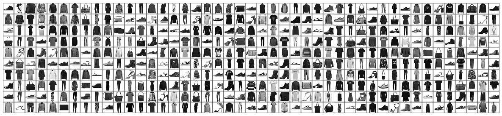
```

Ce premier atelier d'introduction à l'apprentissage profond avec TensorFlow et Keras vous initiera à la **classification** d'images. Nous verrons comment construire et entraîner un modèle de **réseau de neurones profond** permettant de classer des images de vêtements et autres accessoires de mode comme des chemises, des chaussures ou encore des sacs-à-main.

**Cet atelier est une introduction accélérée aux briques élémentaires d'un programme d'apprentissage profond sous TensorFlow/Keras. Il ne vous sera pas nécéssaire de comprendre tous les détails, mais plutôt d'essayer d'acquérir l'intuition sur le fonctionnement de ce type de programme. Les notions techniques plus avancées seront expliquées et illustrées au fur et à mesure des ateliers suivants.**


## 1. Introduction au jeu de données "MNIST de la mode" (Fashion MNIST)

Nous utiliserons le jeu de données **[Fashion MNIST](https://github.com/zalandoresearch/fashion-mnist)**, composé de 70000 images en niveaux de gris et basse résolution représentant chacune une catégorie (ou classe) d'objet parmi 10 catégories différentes. Notre objectif consistera alors à construire et entraîner un réseau de neurones capable de classer l'image dans sa catégorie. On parle alors de **classification simple classe** (single class classification), car à une image ne correspond qu'une seule classe.

```{r ws_1_intro, echo=FALSE}
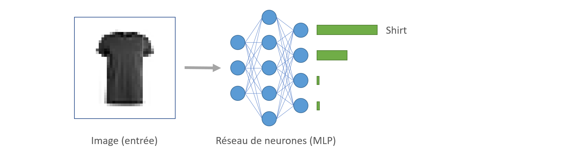
```

Fashion MNIST a été conçu par l'entreprise d'e-commerce [Zalando](https://www.zalando.fr/) pour remplacer le jeu de données [MNIST](http://yann.lecun.com/exdb/mnist/), souvent considéré et utilisé comme le «Hello, World!» des programmes d’apprentissage profond. Le jeu de données MNIST contient des images de chiffres manuscrits (0, 1, 2, etc.) dans un format identique aux images de vêtements que nous utiliserons ici.

```{r ws_1_mnist, echo=FALSE}
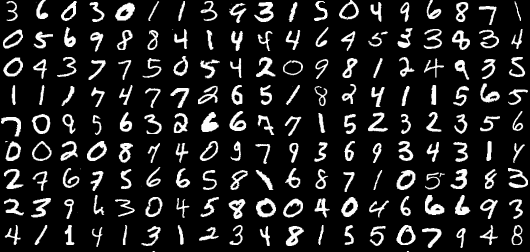
```

Le [dépot GitHub](https://github.com/zalandoresearch/fashion-mnist) pointe quelque uns des inconvénients de "MNIST chiffres":

* Il est trop facile pour un algorithme standard d'apprentissage automatique d'atteindre plus de **97%** de précision.
* Il est encore plus facile pour les algorithmes d'apprentissage profond d'atteindre plus de **99%** de précision.
* Il s'agit d'un jeu de données surutilisé.
* MNIST ne représente pas les problématiques **modernes** de vision numérique.

Ainsi, le jeu de données Fashion MNIST est identique à MNIST chiffres en termes de taille, nombre de catégories (ou classes) et de dimensions d'images:

* 60 000 images (ou exemples) d'entraînement
* 10,000 exemples de test
* 10 catégories
* Images 28×28 pixels en niveaux de gris

Si vous avez déjà entraîné un réseau de neurones sur MNIST chiffres, vous pouvez essentiellement modifier une ou deux lignes de code et entraîner le même réseau sur Fashion MNIST! Vous pouvez aussi partir d'un réseau pré-entraîné sur MNIST chiffres et ré-entraîner ce même réseau sur Fashion MNIST (cette technique, appelée **Apprentissage par Transfert**, sera abordée lors du troisième atelier).

**Pour terminer l'introduction, le jeu de données Fashion MNIST sera utilisé ici à des fins de variété, mais aussi pour apporter un degré de complexité légèrement plus élevé que le MNIST chiffres. Les deux jeux de données sont relativement petits et permettent différents types d'expérimentation pour les débutants en apprentissage profond. Ils peuvent également représenter un bon point de départ pour tester et déboguer de nouvelle techniques.**


## 2. Chargement du jeu de données Fashion MNIST

#### EXERCICE: Charger les librairies Keras et Tensorflow. Utilisez l'implémentation TensorFlow de Keras avec `use_implementation` [Doc.](https://www.rdocumentation.org/packages/keras/versions/2.2.4/topics/use_implementation)

```{r}
# ~ 3 lignes de code

```

**MNIST Fashion** est directement accessible à partir de Keras. Celui-ci sera téléchargé lors de l'appel de la fonction `[dataset_fashion_mnist](https://www.rdocumentation.org/packages/keras/versions/2.2.4/topics/dataset_fashion_mnist)` et chargé en mémoire. Cette étape peut durer jusqu'à 1 minute suivant la vitesse de la connection Internet.

#### EXERCICE: Charger le jeu de données en assignant la valeur de retour de la fonction dataset_fashion_mnist() à la variable `fashion_mnist`.

```{r}
# ~ 1 ligne de code

```

Regardons la structure de la variable `fashion_mnist`

```{r}
str(fashion_mnist)
```

Comme attendu, nous constatons que le jeu de données est séparé en jeu d'entraînement (train) et jeu de test (test). Le jeu d'entraînement est le jeu de données que le réseau de neurones utilise pour apprendre. Le jeu de test ne sera utilisé qu'à la fin pour évaluer les performances du réseau et sa capacité à généraliser sur des images non vues lors de l'entraînement. Ceci est une configuration classique en apprentissage automatique.

Le jeu d'entraînement comprend deux tableaux, `x` et `y`. Le premier correspond aux images et le second aux catégories (ou classes) des images. Effectuons quelques assignations de variables afin d'améliorer la manipulation ultérieure des données:

```{r}
c(train_images, train_labels) %<-% fashion_mnist$train
c(test_images, test_labels) %<-% fashion_mnist$test
```

À ce stade, nous avons 4 tableaux: les tableaux `train_images` et `train_labels` constituent l'ensemble du jeu d'entraînement. Le modèle sera testé par rapport au jeu de test: les tableaux `test_images` et `test_labels`.

Les images sont chacune des matrices de 28 x 28, avec des valeurs (pixels) comprises entre 0 et 255. Les classes sont représentées par un tableau d’entiers, allant de 0 à 9.

| Entier   | Catégorie     |
| -------- |:-------------:|
| 0        | T-shirt/top   |
| 1        | Trouser       |
| 2        | Pullover      |
| 3        | Dress         |
| 4        | Coat          |
| 5        | Sandal        |
| 6        | Shirt         |
| 7        | Sneaker       |
| 8        | Bag           |
| 9        | Ankle boot    |

À chaque image correspond une seule catégorie. Comme le nom des classes n'est pas inclus dans le jeu de données, nous les stockons dans un vecteur à utiliser plus tard lors de l'affichage des images.

```{r}
class_names = c('T-shirt/top',
                'Trouser',
                'Pullover',
                'Dress',
                'Coat', 
                'Sandal',
                'Shirt',
                'Sneaker',
                'Bag',
                'Ankle boot')
```


## 3. Exploration des données

Avant d'entamer la construction d'un modèle de réseaux de neurones, une première étape essentielle en apprentissage automatique consiste à explorer le jeu de données.

#### EXERCICE: Afficher la dimension du tableau `train_images`.

```{r}
# ~ 1 ligne de code 

```

Nous vérifions qu'il y a bien 60000 images, chaque image ayant le format 28x28 pixels en niveaux de gris.

De la même manière, le tableau des catégories comprend 60000 lignes (une pour chaque image):

```{r}
dim(train_labels)
```

Chaque catégorie est encodée par un entier entre 0 et 9:

```{r}
train_labels[1:20]
```

Effectuons les mêmes vérifications sur le jeu de test:

```{r}
dim(test_images)
dim(test_labels)
```


## 4. Préparation des données

Parallèlement à l'exploration des données, il conviendra de nettoyer et préparer les données en recherchant par exemple les valeurs manquantes et aberrantes. Heureusement pour notre atelier, **Fashion MNIST** est un jeu de données déjà prêt à l'emploi.

Inspectons la première image du jeu d'entraînement:

```{r}
N <- 2

image_n <- as.data.frame(train_images[N, , ])
colnames(image_n) <- seq_len(ncol(image_n))
image_n$y <- seq_len(nrow(image_n))
image_n <- gather(image_n, "x", "value", -y)
image_n$x <- as.integer(image_n$x)

ggplot(image_n, aes(x = x, y = y, fill = value)) +
  geom_tile() +
  scale_fill_gradient(low = "white", high = "black", na.value = NA) +
  scale_y_reverse() +
  theme_minimal() +
  theme(panel.grid = element_blank())   +
  theme(aspect.ratio = 1) +
  xlab("") +
  ylab("")
```

Comme nous pouvons le constater, la valeur d'un pixel varie entre 0 et 255. Nous allons donc procéder à la normalisation (ou standardisation) des données. Plusieurs méthodes et variantes peuvent être utilisées. Lorsque nous manipulerons des images, la normalisation s'opèrera en divisant la valeur de chaque pixels par 255. Ainsi, nous obtiendrons des images dont la valeur des pixels est comprise entre 0 et 1.

```{r ws_1_norm, echo=FALSE}
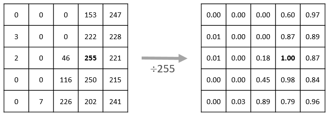
```

**Il est très important que les jeu d'ENTRAÎNEMENT et de TEST soient normalisés de la même façon.**

#### EXERCICE: Normaliser les jeux de données. Conseil: ne pas utiliser le boucle for

```{r}
# ~ 2 lignes de code

```

```{r}
summary(train_images_norm)
```

Affichons les 16 premières images du jeu d'entraînement ainsi que le nom de la catégorie sous chaque image.

```{r}
for (i in 1:16) {
  img <- train_images_norm[i,,]
  img <- t(apply(img, 2, rev))
  image(1:28, 1:28, img, col = gray((0:255)/255), xaxt='n', yaxt='n', asp=1,bty="n",
        main = paste(class_names[train_labels[i] + 1]))}
```

Une fois que nous nous sommes assurés que les données sont sous le bon format, nous pouvons créer le modèle de réseau de neurones et procéder à l'entraînement de celui-ci.


## 5. Les différentes parties d'un programme d'apprentissage profond avec TensorFlow/Keras

```{r ws_1_pipeline, echo=FALSE, out.width = '100%'}
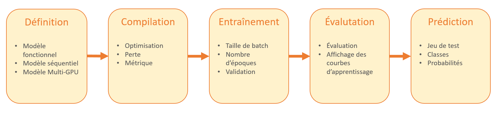
```


## 6. Définition du modèle

```{r ws_1_pipeline_definition, echo=FALSE, out.width = '100%'}
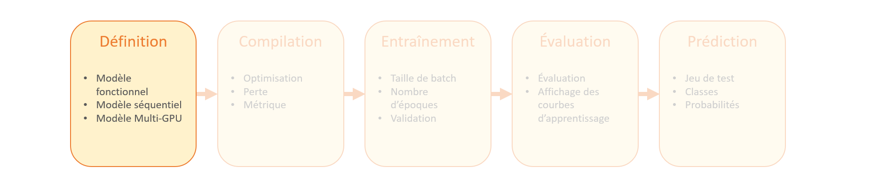
```

La mise en oeuvre d'un réseau de neurones requiert tout d'abord la **définition** d'un modèle. L'élément de base d'un réseau de neurones est la couche. Il s'agira donc de définir le nombre de couches du réseau et le nombre de neurones par couche.

Il existe dans Keras deux principaux types de [modèles](https://keras.rstudio.com/articles/about_keras_models.html):

* [Les modèles séquentiels](https://keras.rstudio.com/articles/sequential_model.html)

* [Les modèles utilisant l'API fonctionnelle](https://keras.rstudio.com/articles/functional_api.html)

Chaque couche apprend (ou extrait) des **représentations** à partir de la couche précédente. Ce représentations permettent ensuite de réaliser la tâche voulue, dans notre exemple catégoriser les images d'entrées.

#### EXERCICE: En utilisant un modèle de type séquentiel, et en vous aidant de la "cheat sheet" fournie, construire le réseau de neurones suivant:

```{r ws_1_dense_network_1, echo=FALSE, out.width = '100%'}
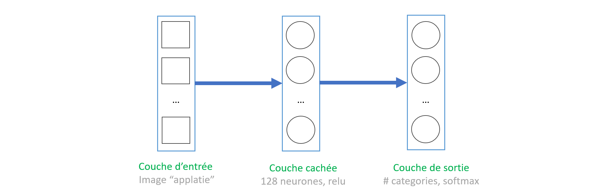
```

* La couche d'entrée sera une transformation de l'image sous forme de vecteur à l'aide de `layer_flatten()`.
* La couche cachée sera de type pleinement connectée `layer_dense()` dont la fonction d'activation sera 'relu'.
* La couche de sortie sera de type pleinement connectée `layer_dense()` dont la fonction d'activation sera 'softmax'.
* Choisir le bon nombre de neurones pour la couche de sortie (nombre de classes).

```{r}
# ~ 5 lignes de code

```

### Remarques:

La première couche de ce réseau, `layer_flatten` transforme l'image d'entrée, qui est une matrice 28x28, en vecteur de longeur 28 * 28 = 784 pixels. On peut voir cette opération comme la mise bout-à-bout de toutes les lignes de l'image. Cette couche ne fait que changer le format de la donnée et ne possède en elle-même aucun poids (ou paramètres) à apprendre.

Une fois que l'image a été "applatie", le réseau de neurone se compose d'un empilement de deux couches **pleinement connectées** (on dit encore denses) de type `layer_dense`. La première possède 128 neurones, tandis que la seconde en possède 10 correspondant aux 10 catégories. Cette dernière est appelée couche de sortie et retourne un vecteur de probabilités dont la somme est 1. Chaque neurone de cette couche représente la probabilité que l'image présentée en entrée appartienne à la catégorie correspondante.

```{r ws_1_softmax, echo=FALSE, out.width = '100%'}
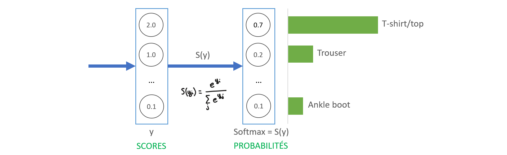
```

Nous pouvons afficher l'architecture du modèle nouvellement crée:

```{r}
summary(model)
```

#### QUESTION: En faisant un calcul très simple, comment pouvez-vous obtenir le nombre de paramètres affiché ci-dessus?


## 7. Compilation du modèle

```{r ws_1_pipeline_compilation, echo=FALSE, out.width = '100%'}
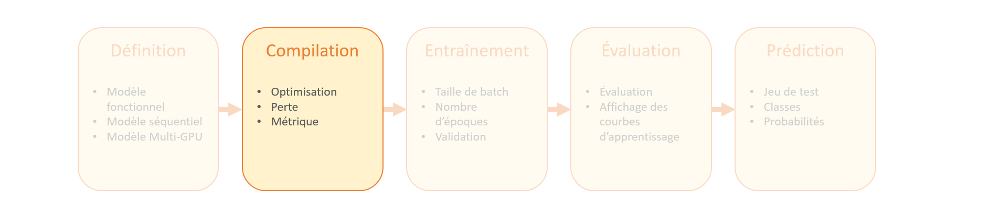
```

La compilation représente la construction par TensorFlow du graphe de calcul. Nous devons définir:

* La fonction à optimiser
* La méthode d'optimisation, basée sur la descente de gradient
* La métrique de performance

Voyons plus en détail ces différents points:

* **Fonction de perte (loss)** — Mesure l'écart entre la valeur prédite par le réseau et la véritable valeur. Nous chercherons à minimiser le risque, c'est-à-dire la somme des pertes de prédiction sur chaque image du jeu de données. Cette minimisation se fera en modifiant les poids du réseau via l'algorithme de rétropropagation du gradient.

* **Optimiseur (optimizer)** — Algorithme de mise-à-jour des poids basé sur la fonction de perte et la descente de gradient.

* **Learning rate** - Hyperparamètre le plus important, définissant en quelque sorte la vitesse d'apprentissage.

* **Métrique (metrics)** — Utilisé pour mesurer la performance du modèle. L'exemple suivant utilise la précision (accuracy), c'est-à-dire la fraction d'images correctement classées. **N.B.: Faire attention aux jeux de données débalancés car la métrique utilisée peut se révéler inadéquate. Dans ce cas, l'AUC ou le F-Score représenterai des métriques plus appropriées.**


```{r ws_1_loss, echo=FALSE, out.width = '100%'}
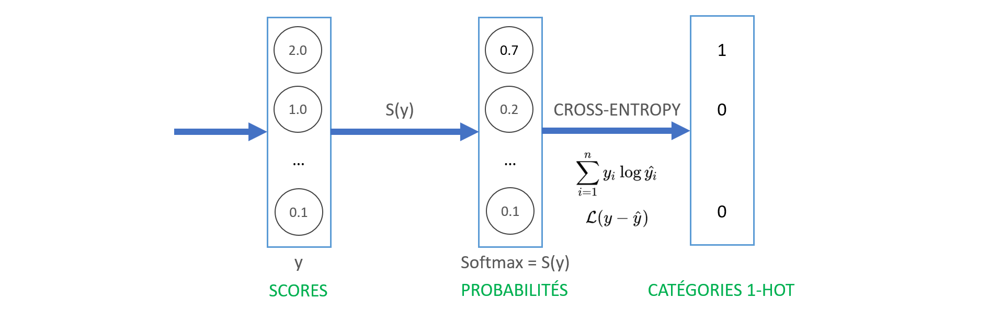
```

#### EXERCICE: En se basant sur la documentation de la fonction `compile()`:

* choisir l'optimiseur **Adam** avec un learning rate de **0.001**
* utiliser **sparse_categorical_crossentropy** comme fonction de coût
* utiliser la **précision** comme métrique.

```{r}
# ~ 4 lignes de code

```

```{r}
# Nous sauvegardons les poids initiaux pour plus tard
model %>% save_model_weights_hdf5("model_1.h5")
```


## 8. Entraînement du modèle

```{r ws_1_pipeline_training, echo=FALSE, out.width = '100%'}
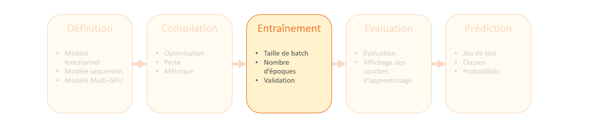
```

Nous pouvons maintenant entraîner le réseau de neurones. Il nous reste à:

* Fournir les données au modèle. Dans notre exemple, les tableaux `train_images` and `train_labels`.
* Choisir une taille de batch et un nombre d'épochs.

L'entraînement se fait en appelant la fonction `fit`:

```{r}
nb_epochs <- 5
bs <- 32

history <- model %>% fit(train_images_norm, train_labels,
                         batch_size=bs,
                         epochs=nb_epochs)
```

#### EXERCICE (OPTIONNEL): Rechargez les poids initiaux (model_1.h5) et entraînez le réseau sur les données non normalisées (train_images). Que constatez-vous ?

```{r}
# ~ 4 lignes de code

```

#### EXERCICE: Repartir l'entraînement avec les données normalisées.


## 9. Évaluation du modèle appris

```{r ws_1_pipeline_eval, echo=FALSE, out.width = '100%'}
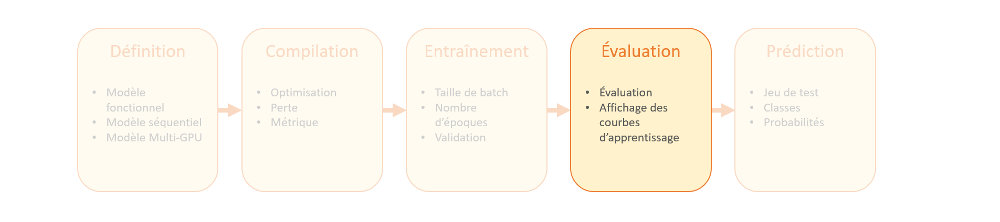
```

Évaluons les performances du modèle sur le jeu de test:

```{r}
score <- model %>% evaluate(test_images_norm, test_labels)

cat('Perte sur le jeu de test:', score$loss, "\n")
cat('Précision sur le jeu de test:', score$acc, "\n")
```

Nous constatons que la précision des prédictions sur le jeu de test est légèrement en deça des prédictions sur le jeu d'entraînement. Cet écart est possiblement un exemple de **surapprentissage** (overfitting). Le surapprentissage survient lorsque le modèle "sur-apprend" le jeu d'entraînement et perd sa capacité à généraliser sur des données nouvelles. Nous allons maintenant voir comment appréhender cette notion de sur-apprentissage.


## 10. Introduction à la notion de sur-apprentissage

Une manière simple de recommencer un entraînement à partir de zéro consiste à recharger les poids initiaux:

```{r}
model %>% load_model_weights_hdf5('model_1.h5')
```

Réentraînons cette fois-ci le modèle en prenant 10% des données d'entraînement comme données de validation. Augmentons aussi le nombre d'époques à 30.

```{r}
history <- model %>% fit(train_images_norm, train_labels, epochs = 30, validation_split=0.1)
```

#### QUESTION: Que constatez-vous ?

Sauvegardons ces courbes d'apprentissage à des fins de comparaison lors de l'atelier #2.

```{r}
data <- data.frame(loss = history[2]$metrics$loss,
                   acc = history[2]$metrics$acc,
                   val_loss = history[2]$metrics$val_loss,
                   val_acc = history[2]$metrics$val_acc)
write.csv(data, file = "history_workshop_1.csv", row.names=FALSE)
```

En fonction des résultats obtenus à l'entraînement précédent, ré-entraînez le modèle à partir de zéro en choisissant le nombre d'époques correspondant à la perte de validation la plus faible. On parle alors de trouver le compromis **biais/variance**.
Remarque: nous verrons lors des ateliers subséquents des méthodes automatiques (EarlyStopping, ModelCheckpoint) pour conserver les meilleurs modèles.

#### EXERCICE: Recharger les poids initiaux et entraîner le modèle avec le nombre d'époques choisi.

```{r}
# ~ 2 lignes de code

```


## 11. Réaliser des prédictions

```{r ws_1_pipeline_predictions, echo=FALSE, out.width = '100%'}
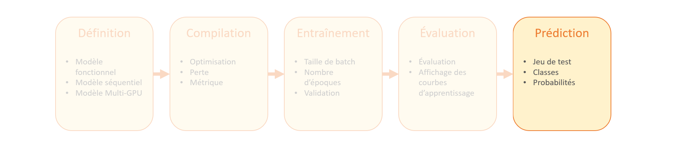
```

Maintenant que nous avons un modèle entraîné suivant un bon compromis biais/variance, utilisons le pour faire quelques prédicitons sur le jeu de test:

```{r}
predictions <- model %>%
  predict(test_images_norm)
```

Ici, le modèle a prédit la catégorie pour chaque image de jeu de test. Regardons la première prédiction:

```{r}
predictions[1, ]
```

Une prédiction est un vecteur de dimension 10. Dans notre cas, nous rappelons que la taille du vecteur correspond au nombre de catégories. Chaque élément du vecteur (ou neurone de sortie) indique la confiance du modèle, ou probabilité de classification:

```{r ws_1_softmax_bis, echo=FALSE, out.width = '100%'}
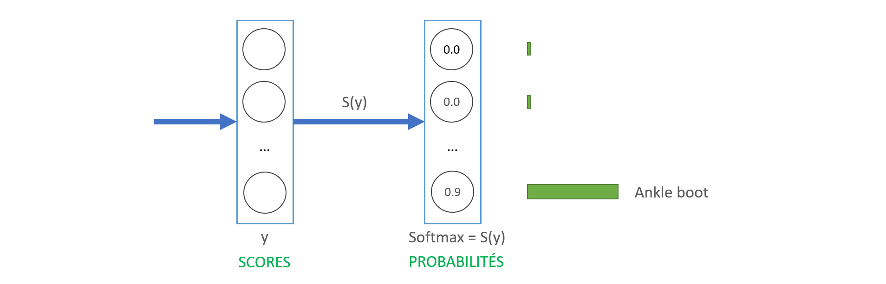
```

```{r}
which.max(predictions[1, ])
```

Il est également possible d'afficher directement la classe, supposant un seuil de 0.5. (Ne pas oublier que les catégories sont encodées à partir de 0)

```{r}
class_pred <- model %>%
  predict_classes(test_images_norm)
class_pred[1:20]
```


Choisir une exemple du jeu de test:

```{r}
N <- 1
```

```{r}
test_labels[N]
class_names[test_labels[N]+1]
```

```{r}
image <- as.data.frame(test_images_norm[N, , ])
colnames(image) <- seq_len(ncol(image))
image$y <- seq_len(nrow(image))
image <- gather(image, "x", "value", -y)
image$x <- as.integer(image$x)

ggplot(image, aes(x = x, y = y, fill = value)) +
  geom_tile() +
  scale_fill_gradient(low = "white", high = "black", na.value = NA) +
  scale_y_reverse() +
  theme_minimal() +
  theme(panel.grid = element_blank())   +
  theme(aspect.ratio = 1) +
  xlab("") +
  ylab("")
```


## 12. EXERCICE OPTIONNEL: Modifier l'architecture du réseau (nombre de couches, nombre de neurones, optimiseur, learning rate, etc...) et comparez les résultats.

```{r}
model <- keras_model_sequential()
model %>%
  layer_flatten(input_shape = c(28, 28))
  # Compléter...
```


## Sources:

[Tutorial: Basic Classification](https://keras.rstudio.com/articles/tutorial_basic_classification.html)