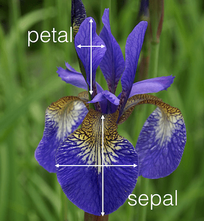

```{r setup, include=FALSE}
knitr::opts_chunk$set(echo = TRUE)
Sys.setenv(TF_CPP_MIN_LOG_LEVEL = "3") # Car TensorFlow est extrèmement bavard...
```

L'**exécution stricte** est un mode pour entraîner un modèle sans création sous-jacente de graph. Au lieu de retourner des **tenseurs**, les opérations sont évaluées et retournent des **valeurs**. Par conséquent, il est possible de vérifier les entrées et les sorties d’une opération en imprimant simplement le contenu d’une variable avec `print`. C'est un avantage important dans le développement de modèles qui facilite le débogage.

Vous pouvez utiliser le mode d'exécution strict de Keras tant que vous utilisez l'implémentation TensorFlow. Ce guide donne un aperçu  des différentes parties d'un programme en mode strict au moyen d'un exemple de régression simple. Plus précisément, vous verrez comment:

* 1.   Configurer votre environnement en mode d'exécution stricte
* 1.1. Définir le modèle
* 1.2. Définir l'optimiseur et la fonction de perte
* 2.   Alimenter le modèle en données lors de la phase d'entraînement
* 3.   Écrire une simple boucle d’entraînement effectuant la rétro-propagation
* 4.   Faire des prédictions sur le jeu de test
* 5.   Exercice optionnel


## 1. Configurer votre environnement en mode d'exécution stricte

**Le mode d'exécution stricte n'est disponible dans TensorFlow que depuis la version 1.9**

```{r libraries}
library(keras)
use_implementation("tensorflow") # Afin d'utiliser l'implémentation TensorFlow de Keras, cette ligne doit être exécutée immédiatement après le chargement de la bibliothèque

library(tensorflow)
tfe_enable_eager_execution(device_policy="silent") # Activer l'exécution stricte. L'argument device_policy n'est requis que lorsqu'un GPU est utilisé

#devtools::install_github("rstudio/tfdatasets") # Ne pas installer tfdatasets avec install.packages() !!!
library(tfdatasets)
```

Il est possible de vérifier le mode d'exécution avec:

```{r}
tf$executing_eagerly()
```


## 1.1 Définition du modèle

Pour pouvoir être utilisés en mode stricte, les modèles doivent être définis en utilisant les **modèles personalisés**: `[keras_model_custom](https://www.rdocumentation.org/packages/keras/versions/2.2.4.1/topics/keras_model_custom)`

Les modèles personnalisés sont généralement constitués de couches Keras, configurées comme à l'habitude. Cependant, vous êtes libre d’implémenter une logique personnalisée dans la fonction d’appel (implicite) du modèle.

Notre exemple de régression simple utilisera le jeu de données **iris** pour prédire `Sepal.Width` à partir de `Petal.Length`, `Sepal.Length` et `Petal.Width`.

```{r ws_5_iris_petal_sepal, echo=FALSE}

```

Construisons le modèle à l'aide de `keras_model_custom`:

```{r}
iris_regression_model <- function(name = NULL) {
  
  keras_model_custom(name = name, function(self) {
    
    # ici sont déclarées les couches (l'ordre importe peu)
    self$dense1 <- layer_dense(units = 32)
    self$dropout <- layer_dropout(rate = 0.5)
    self$dense2 <- layer_dense(units = 1)
    
    # # la construction du modèle est réalisée lors de l'appel de cette fonction
    function (x, mask = NULL) {
      x %>% 
        self$dense1() %>%
        self$dropout() %>%
        self$dense2()
    }
  })
}
```

Le modèle est ensuite instancié:

```{r}
model <- iris_regression_model()
```

À ce stade ci, **les dimensions des poids du modèle ne sont pas définis**, car nous n'avons pas précisé de dimension pour la couche d'entrée. Cependant, nous pouvons appeler ce modèle avec des données fictives:

```{r}
dummy_data <- k_constant(matrix(1:6, nrow = 2, ncol = 3))
model(dummy_data)
```

#### QUESTION: Expliquez la dimension du tenseur obtenu.

Il est alors possible d'inspecter les poids du modèle:

```{r}
model$weights
```


## 1.2 Définition des fonctions de perte et de l'optimiseur

Dans un contexte de régression linéaire, nous utilisons l'erreur quadratique moyenne (MSE) bien connue:

```{r}
mse_loss <- function(y_true, y_pred, x) {
  # Il est ici requis d'utiliser une fonction de TensorFlow, et non de keras (loss_mean_squared_error())
  mse <- tf$losses$mean_squared_error(y_true, y_pred)
  # Nous pourrions ajouter ici le calcul d'autres fonction de perte (mae, etc...)
  mse
}
```

De la même manière, choisissons un optimiseur

```{r}
# Nous devons utiliser un optimiseur de TensorFlow (tf$train) et non de Keras
optimizer <- tf$train$AdamOptimizer()
```


## 2. Alimentation du modèle en données avec tfdatasets 

En mode d'exécution stricte, nous allons utilisez `tfdatasets` pour alimenter le modèle en données. Dans notre exemple d'iris, nous utilisons `tensor_slices_dataset` afin de créer directement un jeu de données à partir des matrices R sous-jacentes `x_train` et `y_train`.

Cependant, une grande variété d'autres fonctions de création de jeu de données est disponible, permettant aussi diverses transformations de prétraitement.

```{r}
x_train <- iris[1:120, c("Petal.Length", "Sepal.Length", "Petal.Width")] %>% as.matrix()
x_train <- k_constant(x_train)

y_train <- iris[1:120, c("Sepal.Width")] %>% as.matrix()
y_train <- k_constant(y_train)

x_test <- iris[121:150, c("Petal.Length", "Sepal.Length", "Petal.Width")] %>% as.matrix()
x_test <- k_constant(x_test)

y_test <- iris[121:150, c("Sepal.Width")] %>% as.matrix()
y_test <- k_constant(y_test)
```

```{r}
train_dataset <- tensor_slices_dataset(list(x_train,y_train)) %>%
  dataset_batch(10)
test_dataset <- tensor_slices_dataset(list (x_test, y_test)) %>%
  dataset_batch(10)
```

Nous déclarons ensuite un iterateur `make_iterator_one_shot` qui permettra d'accéder aux données par batch (taille définie ci-dessus):

```{r}
iter <- make_iterator_one_shot(train_dataset)
```

L'itération (pour obtenir la prochaine batch) se fait par appels successifs de `iterator_get_next`:

```{r}
batch <-  iterator_get_next(iter)
batch
```


## 3. Boucle d'entraînement


Avec ce mode d'exécution, le processus d'entraînement doit être codé de manière explicite. Ceci donne en contrepartie un contrôle accru du processus.

En général, deux boucles seront nécessaires: une boucle externe d'itération d'époque et une boucle interne d'itération des batches de données retournées par l'itérateur (implémentée implicitement par `until_out_of_range`). **L'itérateur doit être recréé au début de chaque nouvelle époque.**

```{r}
n_epochs <- 10

# Première boucle d'itération: époques
for (i in seq_len(n_epochs)) {
  
  # Création d'un nouvel itérateur
  iter <- make_iterator_one_shot(train_dataset)
  
  # accumulation de la perte sur l'époque
  total_loss <- 0
  
  # Itération su les données
  until_out_of_range({
    
    # Obtenir la batch suivante
    batch <-  iterator_get_next(iter)
    x <- batch[[1]]
    y <- batch[[2]]
    
    # tf$GradientTape est utilisé pour stocker la phase d'inférence
    with(tf$GradientTape() %as% tape, {
     
      # Le modèle est évalué sur la batch courante
      preds <- model(x)
     
      # Calcul de la perte
      loss <- mse_loss(y, preds, x)
    })
    
    # Mise à jour de la perte par époque
    total_loss <- total_loss + loss
    
    # Obtenir les gradients de la perte par rapport au poids du modèle
    gradients <- tape$gradient(loss, model$variables)
    
    # Mise-à-jour des poids du modèle
    optimizer$apply_gradients(
      purrr::transpose(list(gradients, model$variables)),
      global_step = tf$train$get_or_create_global_step()
    )
  })
  cat("Perte (époque): ", i, ": ", as.numeric(total_loss), "\n")
}
```


## 4. Prédictions sur le jeu de test

En mode strict, la prédiction est d'une facilité déconcertante. Il suffit d'appeler le modèle en passant le tenseur contenant les données de test:

```{r}
model(x_test)
```


## 5. Exercice (optionnel)

Reprendre l'un des ateliers de votre choix en utilisant le mode d'exécution stricte.


## Sources

* Ce fichier R Markdown est une version retravaillée et traduite de l'excellent article [Keras with Eager Execution](https://keras.rstudio.com/articles/eager_guide.html) de JJ Allaire et François Chollet.