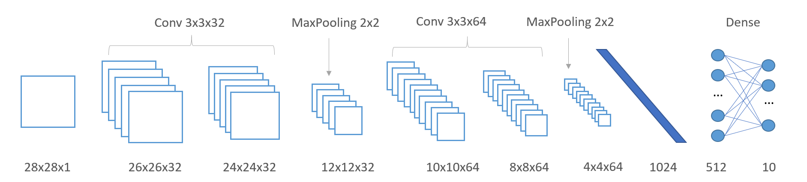

```{r setup, include=FALSE}
knitr::opts_chunk$set(echo = TRUE)
Sys.setenv(TF_CPP_MIN_LOG_LEVEL = "3") # Car TensorFlow est extrèmement bavard...
```

```{r libraries}
suppressWarnings(library(dplyr))
suppressWarnings(library(ggplot2))
suppressWarnings(library(tidyr))
suppressWarnings(library(tibble))
library(keras)
library(tensorflow)
use_implementation("tensorflow")
```

```{r ws_2_banner, echo=FALSE, fig.cap="", out.width='100%'}

```


## 1. Introduction aux réseaux de neurones convolutifs

Nous avons vu lors du premier atelier comment construire et entraîner un modèle de réseau de neurones permettant de **classer** des images du jeu de données **Fashion MNIST**. Les résultats, spectaculaires compte tenu du nombre de ligne de codes, peuvent être encore dépassés grâce aux **réseaux de neurones convolutifs profonds** (ou Convnets). Ce type de réseau a révolutionné la vision numérique et il n'existe aujourd'hui aucune autre méthode en mesure de le rivaliser.

Rendons nous sur la page [2D Visualization of a Convolutional Neural Network](http://scs.ryerson.ca/~aharley/vis/conv/flat.html) afin de comprendre l'intuition derrière ce type de réseau.

```{r ws_2_representations, echo=FALSE, out.width = '100%'}

```


## 2. Chargement et préparation des données

Les étapes ci-dessous sont identiques à celles du premier atelier:

```{r}
fashion_mnist <- dataset_fashion_mnist()

c(train_images, train_labels) %<-% fashion_mnist$train
c(test_images, test_labels) %<-% fashion_mnist$test

class_names <- c('T-shirt/top',
                'Trouser',
                'Pullover',
                'Dress',
                'Coat', 
                'Sandal',
                'Shirt',
                'Sneaker',
                'Bag',
                'Ankle boot')

train_images_norm <- train_images / 255
test_images_norm <- test_images / 255
```

Les couches de convolutions que nous allons mettre en oeuvre requièrent un format d'entrée de dimension 3, c'est-à-dire **hauteur x largeur x canal**. "canal" représente le nombre de nombre de canaux dans l'image (1 pour niveau de gris, 3 pour couleur RGB).

Les images du jeu de données Fashion MNIST sont, rappelons-le, des tableaux de dimension 2, soit 28 x 28. Il sera nécessaire d'ajouter une dimension supplémentaire pour obtenir un tableau de dimension 3, c'est-à-dire **28x28x1**.


#### EXERCICE: Ajoutez une dimension pour le canal en utilisant la fonction `array_reshape` ou `k_expand_dims`. N'oubliez pas d'appliquer cette modification sur le jeu de test aussi.
[k_expand_dims](https://www.rdocumentation.org/packages/keras/versions/2.1.2/topics/k_expand_dims)
[array_reshape](https://rstudio.github.io/reticulate/reference/array_reshape.html)

```{r}
# ~ 1-2 lignes de code
train_images_norm <- array_reshape(train_images_norm, c(dim(train_images_norm)[1], dim(train_images_norm)[2], dim(train_images_norm)[3], 1))
test_images_norm <- array_reshape(test_images_norm, c(dim(test_images_norm)[1], dim(test_images_norm)[2], dim(test_images_norm)[3], 1))
```


## 2. Définition du modèle

Nous allons maintenant définir un modèle de réseau convolutif relativement simple:

Ce modèle, de type **séquentiel**, sera constitué successivement des couches suivantes:

* Deux couches convolutives successives 3x3 comprenant 32 filtres
* Une couche de MaxPooling
* Deux couches convolutives successives 3x3 comprenant 64 filtres
* Une couche de MaxPooling
* Une couche pleinement connectée composée de 128 neurones
* Une couche de sortie correspondant au nombre de catégories

Les couches convolutives utiliseront une activation de type **relu**

#### QUESTION: Quel type d'activation utilisez-vous pour la couche de sortie?

```{r ws_2_convnet, echo=FALSE, out.width = '100%'}

```

#### EXERCICE: Implémentez le réseau de neurones décrit ci-dessus.

```{r}
# ~ 11 lignes de code
model <- keras_model_sequential()

model %>%
  layer_conv_2d(filters = 32, kernel_size = 3, activation = 'relu', input_shape=c(28,28,1)) %>%
  layer_conv_2d(filters = 32, kernel_size = 3, activation = 'relu') %>%
  layer_max_pooling_2d() %>%
  
  layer_conv_2d(filters = 64, kernel_size = 3, activation = 'relu') %>%
  layer_conv_2d(filters = 64, kernel_size = 3, activation = 'relu') %>%
  layer_max_pooling_2d() %>%
  
  layer_flatten() %>%
  layer_dense(units = 512, activation = 'relu') %>%
  layer_dense(units = 10, activation = 'softmax')
```

Nous pouvons afficher l'architecture du modèle:

```{r}
summary(model)
```


## 3. Compilation du modèle

#### QUESTION: Quelle est la signification du paramètre "loss" de la fonction compile ?

```{r}
model %>% compile(
  optimizer = optimizer_adam(lr=0.001), 
  loss = 'sparse_categorical_crossentropy',
  metrics = c('accuracy')
)
```


## 4. Entraînement du modèle

#### EXERCICE: Entraînez le réseau de neurones sur 15 époques et avec une taille de batch de 32. Gardez un oeil sur le sur-apprentissage en utlisant un jeu de validation de 10%. Assignez la valeur de retour de `fit` à la variable `history_conv`.

```{r}
# ~ 1 ligne de code
history_conv <- model %>% fit(train_images_norm, train_labels, epochs=15, validation_split=0.1, batch_size=32)
```


## 5. Comparaison avec l'atelier #1 (Perceptron Multicouche)

```{r}
history_baseline <- read.csv("history_workshop_1.csv", header=TRUE, sep=",")
```

```{r}
compare_cx <- data.frame(
  conv_train = history_conv$metrics$loss,
  conv_val = history_conv$metrics$val_loss,
  base_train = history_baseline$loss,
  base_val = history_baseline$val_loss
) %>%
  rownames_to_column() %>%
  mutate(rowname = as.integer(rowname)) %>%
  gather(key = "type", value = "value", -rowname)
  
ggplot(compare_cx, aes(x = rowname, y = value, color = type)) +
  geom_line() +
  xlab("epoch") +
  ylab("loss")+
  xlim(0, 15)
```

```{r}
compare_cx <- data.frame(
  conv_train = history_conv$metrics$acc,
  conv_val = history_conv$metrics$val_acc,
  base_train = history_baseline$acc,
  base_val = history_baseline$val_acc
) %>%
  rownames_to_column() %>%
  mutate(rowname = as.integer(rowname)) %>%
  gather(key = "type", value = "value", -rowname)
  
ggplot(compare_cx, aes(x = rowname, y = value, color = type)) +
  geom_line() +
  xlab("epoch") +
  ylab("accuracy") +
  xlim(0, 15)
```


## 6. Normalisation de batch

La **normalisation de batch**, comme son nom l'indique, consiste à normaliser les activations d'une couche donnée avant de les transmettre à la couche suivante. Cette technique s'est montrée efficace pour réduire le nombre d’époques nécessaires pour entraîner un réseau de neurones.

```{r ws_2_batchnorm, echo=FALSE, out.width = '100%'}

```

#### EXERCICE: Ajoutez des couches de type `layer_batch_normalization`. Optionel: désactivez le biais des couches convolutives et denses.

```{r}
# ~ 21 lignes de code
model <- keras_model_sequential()

model %>%
  layer_conv_2d(filters = 32, kernel_size = 3, use_bias = FALSE, input_shape = c(28, 28,1)) %>%
  layer_batch_normalization() %>%
  layer_activation_relu() %>%
  layer_conv_2d(filters = 32, kernel_size = 3, use_bias = FALSE) %>%
  layer_batch_normalization() %>%
  layer_activation_relu() %>%
  layer_max_pooling_2d() %>%

  layer_conv_2d(filters = 64, kernel_size = 3, use_bias = FALSE) %>%
  layer_batch_normalization() %>%
  layer_activation_relu() %>%
  layer_conv_2d(filters = 64, kernel_size = 3, use_bias = FALSE) %>%
  layer_batch_normalization() %>%
  layer_activation_relu() %>%
  layer_max_pooling_2d() %>%

  layer_flatten() %>%
  layer_dense(units = 512, use_bias = FALSE) %>%
  layer_batch_normalization() %>%
  layer_activation_relu() %>%
  layer_dense(units = 10, activation = 'softmax')
  
  
  summary(model)
```

```{r}
model %>% compile(
  optimizer = optimizer_adam(lr=0.001), 
  loss = 'sparse_categorical_crossentropy',
  metrics = c('accuracy')
)
```

```{r}
history_batchnorm <- model %>% fit(train_images_norm, train_labels, epochs=15, validation_split=0.1, batch_size=32)
```

```{r}
compare_cx <- data.frame(
  conv_train = history_conv$metrics$acc,
  conv_val = history_conv$metrics$val_acc,
  bn_train = history_batchnorm$metrics$acc,
  bn_val = history_batchnorm$metrics$val_acc
) %>%
  rownames_to_column() %>%
  mutate(rowname = as.integer(rowname)) %>%
  gather(key = "type", value = "value", -rowname)
  
ggplot(compare_cx, aes(x = rowname, y = value, color = type)) +
  geom_line() +
  xlab("epoch") +
  ylab("loss")
```


## 7. Régularisation

Il existe plusieurs moyens de réduire le surapprentissage:

* Utiliser plus de données (nous verrons dans l'atelier comment augmenter la taille du jeu de données de manière artificielle)
* Réduire la capacité du réseau (nombre de couches, nombre de neurones, etc..)
* Ajouter une régularisation sur les poids
* Ajouter une régularisation de type **dropout**. **Nous allons voir cette méthode maintenant.**

**Dropout** est l’une des techniques de régularisation des réseaux de neurones les plus efficaces et les plus couramment utilisées. Elle a été mise au point par [Geoffrey Hinton](https://fr.wikipedia.org/wiki/Geoffrey_Hinton) et ses étudiants de l’Université de Toronto. Le **Dropout**, appliqué à une couche, consiste à «éteindre» de manière aléatoire un certain nombre de neurones de la couche **pendant l’entraînement**.

Par exemple, si une couche donnée avait normalement renvoyé le vecteur [0.2, 0.5, 1.3, 0.8, 1.1] pour un échantillon d’entrée donné pendant l’entraînement; après application du **Dropout**, ce vecteur comprendrait quelques zeros répartis de manière aléatoire, par ex. [0, 0,5, 1,3, 0, 1.1].

```{r ws_2_dropout, echo=FALSE, out.width = '100%'}

```

Le «taux de Dropout» correspond à la fraction des neurones mise à zéro. Très souvent, sa valeur varie entre 0.2 et 0.5. Au moment de l'inférence, aucun neurone n’est éteint et les valeurs de sortie de la couche sont réduites d’un facteur égal au taux de Dropout, de manière à compenser le fait que plus de neurones sont actifs lors de l'inférence que lors de l'entraînement.

Dans Keras, Le **Dropout** se rajoute comme une couche, via `layer_dropout` et `layer_spatial_dropout_2d`.
[layer_dropout](https://www.rdocumentation.org/packages/keras/versions/2.2.4.1/topics/layer_dropout)
[layer_spatial_dropout_2d](https://keras.rstudio.com/reference/layer_spatial_dropout_2d.html)

#### EXERCICE: Reprenez l'architecture de la partie 2 et ajoutez une couche de Dropout avant chaque opération de MaxPooling. Ajoutez une autre couche de dropout avant la couche de sortie. Utilisez 0.25 comme taux. Compilez et entraînez le réseau.

```{r}
# ~ 21 lignes de code
model <- keras_model_sequential()

model %>%
  layer_conv_2d(filters = 32, kernel_size = 3, use_bias = FALSE, input_shape = c(28, 28,1)) %>%
  layer_batch_normalization() %>%
  layer_activation_relu() %>%
  layer_conv_2d(filters = 32, kernel_size = 3, use_bias = FALSE) %>%
  layer_batch_normalization() %>%
  layer_activation_relu() %>%
  layer_spatial_dropout_2d(0.25) %>%
  layer_max_pooling_2d() %>%

  layer_conv_2d(filters = 64, kernel_size = 3, use_bias = FALSE) %>%
  layer_batch_normalization() %>%
  layer_activation_relu() %>%
  layer_conv_2d(filters = 64, kernel_size = 3, use_bias = FALSE) %>%
  layer_batch_normalization() %>%
  layer_activation_relu() %>%
  layer_spatial_dropout_2d(0.25) %>%
  layer_max_pooling_2d() %>%

  layer_flatten() %>%
  layer_dense(units = 512, use_bias = FALSE) %>%
  layer_batch_normalization() %>%
  layer_activation_relu() %>%
  layer_dropout(0.25) %>%
  layer_dense(units = 10, activation = 'softmax')

  model %>%
    save_model_weights_hdf5("model_2.h5")
```

```{r}
  summary(model)
```

```{r}
model %>% compile(
  optimizer = optimizer_adam(lr=0.001), 
  loss = 'sparse_categorical_crossentropy',
  metrics = c('accuracy')
)
```

```{r}
history_reg <- model %>% fit(train_images_norm, train_labels, epochs=15, validation_split=0.1, batch_size=32)
```

Comparons l'évolution de la perte avec et sans dropout:

```{r}
compare_cx <- data.frame(
  bn_train = history_batchnorm$metrics$loss,
  bn_val = history_batchnorm$metrics$val_loss,
  reg_train = history_reg$metrics$loss,
  reg_val = history_reg$metrics$val_loss
) %>%
  rownames_to_column() %>%
  mutate(rowname = as.integer(rowname)) %>%
  gather(key = "type", value = "value", -rowname)
  
ggplot(compare_cx, aes(x = rowname, y = value, color = type)) +
  geom_line() +
  xlab("epoch") +
  ylab("loss")
```


## 8. Un mot sur les Callbacks

Les callbacks servent à sauvegarder automatiquement les points de contrôle (checkpoints) pendant l'entraînement. De cette façon, vous pouvez reprendre l'entraînement d'un modèle à n'importe quelle époque ou bien garder le modèle ayant la meilleure erreur de validation. Les poids sont sauvegardés sous le format HDF5.

```{r}
checkpoint_dir <- "checkpoints"
dir.create(checkpoint_dir, showWarnings = FALSE)
filepath <- file.path(checkpoint_dir, "weights.{epoch:02d}-{val_loss:.2f}.hdf5")

# Create checkpoint callback
cp_callback <- callback_model_checkpoint(
  filepath = filepath,
  save_weights_only = TRUE,
  save_best_only = TRUE,
  verbose = 1
)

list.files(checkpoint_dir)
```

```{r}
model %>% load_model_weights_hdf5('model_2.h5')

history_reg <- model %>% fit(
  train_images_norm,
  train_labels,
  epochs=15,
  validation_split=0.1,
  batch_size=32,
  callbacks = list(cp_callback)
  )
```


## 9. Évaluation du modèle appris

Évaluons les performances du meilleur modèle sur le jeu de test:

#### EXERCICE: Chargez le meilleur modèle et évaluez le à l'aide de la fonction `evaluate`

```{r}
# ~ 2-3 lignes de code

#filepath <- file.path(checkpoint_dir, "weights.12-0.19.hdf5")
#model %>% load_model_weights_hdf5(filepath)
#score <- model %>% evaluate(test_images_norm, test_labels)

#cat('Test loss:', score$loss, "\n")
#cat('Test accuracy:', score$acc, "\n")
```


## 10. EXERCICE OPTIONNEL: Essayez d'atteindre 95% de précision en modifiant l'architecture et les hyperparamètres du réseau

```{r}
model <- keras_model_sequential()
# Compléter...
```


## Sources

[Fashion MNIST with Keras and Deep Learning](https://www.pyimagesearch.com/2019/02/11/fashion-mnist-with-keras-and-deep-learning/)
[Tutorial: Overfitting and Underfitting](https://keras.rstudio.com/articles/tutorial_overfit_underfit.html)
[How convolutional neural networks see the world](https://blog.keras.io/how-convolutional-neural-networks-see-the-world.html)
[Tutorial: Save and Restore Models](https://keras.rstudio.com/articles/tutorial_save_and_restore.html)
