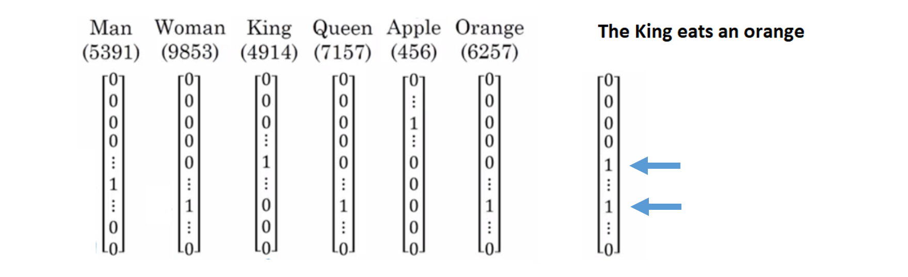
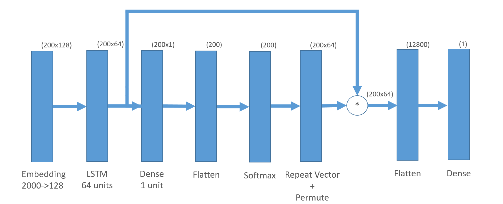

```{r setup, include=FALSE}
knitr::opts_chunk$set(echo = TRUE)
Sys.setenv(TF_CPP_MIN_LOG_LEVEL = "3") # Car TensorFlow est extrèmement bavard...
```

```{r libraries}
library(keras)
library(ggplot2)
library(keras)
library(plotROC)
library(tensorflow)
#use_implementation("tensorflow")
```

Cet atelier a pour objectif de présenter deux types d’applications couramment utilisées en traitement automatique du langage naturel (NLP):

* L’**analyse de sentiments**, qui vise à extraire le ressenti d'un texte (généralement positif ou négatif) en fonction des mots et du type de langage utilisé.
* La **classification et catégorisation de documents**, qui consiste à classer de façon automatique des ressources documentaires, généralement en provenance d'un corpus.

Parmi les différentes approches, l’apprentissage profond offre des performances inégalées en termes de précision et d’extraction de représentations. Nous verrons successivement comment réaliser ces applications à l’aide de:

1. Perceptron multicouche (MLP)
2. Réseaux récurrents (GRU/LSTM)
3. Mécanismes d'attention


## 1. Classification et catégorisation de documents à l'aide de MLP

```{r ws_3_text_classification, echo=FALSE, out.width = '100%'}
knitr::include_graphics("images/ws_3_text_classification.png")
```

L'objectif de cette première partie est la catégorisation les différents documents du jeu de données à l'aide d'un perceptron multi couche. Nous allons ainsi utiliser le jeu de données **"Reuters Newswire Topics Classification"**
Il s'agit d'un jeu de données étiquetté comprenant 11 228 articles de nouvelles extraites du site Internet **[Reuters](https://www.reuters.com/)**. Chaque article est étiquetté parmi 46 catégories et pré-encodé suivant une séquence d'indices de mots.


### 1.1 Chargement du jeu de données


#### EXERCICE:

Charger le jeu de données en incluant au plus 1000 mots. Prévoir d'utiliser 20% des données comme données de test (utiliser le paramètre `seed` pour reproductibilité). Au besoin, se référer à la documentation suivante: [dataset_reuters](https://www.rdocumentation.org/packages/keras/versions/2.2.4/topics/dataset_reuters).

```{r}
# ~ 1-3 lignes de code
max_words <- 1000
split <- 0.2
reuters <- dataset_reuters(num_words = max_words, test_split = split)
```

```{r}
x_train <- reuters$train$x
y_train <- reuters$train$y
x_test <- reuters$test$x
y_test <- reuters$test$y
```


### 1.2 Exploration des données

```{r}
cat(length(x_train), 'séquences d\'entraînement\n')
cat(length(x_test), 'séquences de test\n')

num_classes <- max(y_train) + 1
cat(num_classes, 'catégories\n')
```

```{r}
x_train[1]
x_train[2]
```

Le nom des différentes catégories a été obtenu [ici](https://github.com/keras-team/keras/issues/12072)

```{r}
class_names <- c('cocoa','grain','veg-oil','earn','acq','wheat','copper','housing','money-supply',
 'coffee','sugar','trade','reserves','ship','cotton','carcass','crude','nat-gas',
 'cpi','money-fx','interest','gnp','meal-feed','alum','oilseed','gold','tin',
 'strategic-metal','livestock','retail','ipi','iron-steel','rubber','heat','jobs',
 'lei','bop','zinc','orange','pet-chem','dlr','gas','silver','wpi','hog','lead')
```

#### EXERCICE: Afficher la distribution de différentes catégories (variable `y_train`) à l'aide de la librairie `ggplot2`

```{r}
# ~ 1-3 lignes de code
cat <- data.frame(class_names[y_train])
colnames(cat) <- c('tag')
g <- ggplot(data=cat, aes(tag)) + geom_bar() + theme(axis.text.x = element_text(angle = 45, hjust = 1))
g
```


### 1.3 Préparation des données

Nous avons vu précédemment que les séquences de mots d'un article ont été préalablement encodées sous forme d'indices d'entiers. Bien qu'il soit possible de l'utiliser telle quelle, cette forme d'encodage n'est pas recommandée pour les réseaux de neurones. Une solution consiste donc à encoder des variables catégorielles sous forme de vecteurs binaires. Chaque valeur entière est représentée sous la forme d’un vecteur binaire qui correspond à zéro sauf pour l’indice de l’entier qui est marqué d’un 1. Le vecteur binaire correspondant est donc une combinaison de vecteurs one-hot. La fonction [text_tokenizer](https://www.rdocumentation.org/packages/keras/versions/2.2.4.1/topics/text_tokenizer) sera utilisée.

```{r ws_3_token, echo=FALSE, out.width = '100%'}

```

```{r}
tokenizer <- text_tokenizer(num_words = max_words)
x_train_token <- sequences_to_matrix(tokenizer, x_train, mode = 'binary')
x_test_token <- sequences_to_matrix(tokenizer, x_test, mode = 'binary')

cat('x_train shape:', dim(x_train_token), '\n')
cat('x_test shape:', dim(x_test_token), '\n')

# Conversion du vecteur d'étiquettes en matrice binaire adaptée à la fonction de perte categorical_crossentropy
y_train <- to_categorical(y_train, num_classes)
y_test <- to_categorical(y_test, num_classes)
cat('y_train shape:', dim(y_train), '\n')
cat('y_test shape:', dim(y_test), '\n')
```


### 1.4 Construction et compilation du modèle

#### EXERCICE: Construire un modèle séquentiel Keras comprenant:

- Une couche d'entrée de type `layer_dense`. Choisir le nombre de neurones ainsi que la fonction d'activation. N'oubliez pas de préciser le paramètre `input_shape`.
- Une couche de sortie de type `layer_dense`. Le nombre de neurones doit correspondre au nombre de classes et la fonction d'activation `softmax` sera utilisée.
- Si besoin, ajoutez de la régularisation et de la normalisation de batch.
- OPTIONNEL: essayez avec l'architecture (nombre de couches, nombre de neurones) et les hyperparamètres (optimiseur, learning rate, taille de batch) de votre choix.

```{r}
# ~ 7 lignes de code
model <- keras_model_sequential()
model %>%
  layer_dense(units = 512, input_shape = c(max_words)) %>% 
  layer_activation(activation = 'relu') %>% 
  layer_dropout(rate = 0.5) %>%
  layer_dense(units = num_classes) %>% 
  layer_activation(activation = 'softmax')
```

```{r}
summary(model)
```

#### EXERCICE: Compiler le modèle en précisant la fonction de coût, le type d'optimiseur et la métrique.

```{r}
# ~ 4 lignes de code
model %>% compile(
  loss = 'categorical_crossentropy',
  optimizer = 'adam',
  metrics = c('accuracy')
)
```


### 1.5 Entraînement du modèle

```{r}
history_reuters_mlp <- model %>% fit(
  x_train_token, y_train,
  batch_size = 24,
  epochs = 15,
  verbose = 1,
  validation_split = 0.1
)
```


### 1.7 Évaluation du modèle

```{r}
score <- model %>% evaluate(
  x_test_token, y_test,
  batch_size = 24,
  verbose = 1
)

cat('Perte sur le test:', score[[1]], '\n')
cat('Précision sur le test', score[[2]], '\n')
```


## 3. Analyse de sentiments à l'aide de réseaux récurrents

```{r IMDb, echo=FALSE, out.width = '100%'}
knitr::include_graphics("images/IMDb.png")
```

Nous allons pour cette partie utiliser le jeu de données **"IMDB Movie reviews sentiment classification"**, comprenant 25 000 critiques de films de IMDb, étiquetées par le sentiment (positif / négatif). Les critiques ont été pré-encodées et chacune est codée sous forme d'une séquence d'index de mots (entiers). Pour des raisons pratiques, les mots sont indexés par fréquence globale dans le jeu de données, de sorte que, par exemple, le nombre entier "3" code le troisième mot le plus fréquent dans les données. Cela permet d'effectuer des opérations de filtrage rapides telles que: "ne considérez que les 10 000 mots les plus communs, mais éliminez les 20 mots les plus courants".


## 3.1 Introduction aux réseaux récurrents

```{r ws_3_rnn, echo=FALSE, fig.cap="Logo de Reuters", out.width = '100%'}

```


## 3.2 Chargement du jeu de données

La fonction [dataset_imdb](https://www.rdocumentation.org/packages/keras/versions/2.2.4/topics/dataset_imdb) est utilisée afin de télécharger le jeu de données (cette étape peut prendre un peu de temps).

#### EXERCICE: Charger le jeu de données dans la variable imdb en incluant au plus 2000 mots.

```{r}
# ~ 1 ligne de code
imdb <- dataset_imdb(num_words = 2000)
```

```{r}
x_train <- imdb$train$x
y_train <- imdb$train$y
x_test <- imdb$test$x
y_test <- imdb$test$y
```


### 3.3 Exploration des données

```{r}
cat(length(x_train), 'séquences d\'entraînement\n')
cat(length(x_test), 'séquences de test\n')
```

```{r}
x_train[1]
```

#### EXERCICE: Afficher la distribution de différentes catégories (variable `y_train`)

```{r}
# ~ 1 ligne de code
qplot(y_train, geom="bar")
```

Nous constatons que le jeu de données est parfaitement balancé.

Puisque nous allons utliser des réseaux récurrent avec des "batches", nous devrons réaliser une opération de padding afin que tous les exemples d'une même batch aient la même longeur. A des fins pratiques, nous tronquerons les exemples à 200 mots.

```{r}
x_train <- pad_sequences(x_train, maxlen = 200)
x_test <- pad_sequences(x_test, maxlen = 200)
cat('dimension de x_train:', dim(x_train), '\n')
cat('dimension de x_test:', dim(x_test), '\n')
```


### 3.4 Construction du modèle

Nous allons dans cet exercice mettre en oeuvre un réseau récurrent de type GRU ou LSTM. En pratique les RNN "vanilles" ne sont pas utilisés à cause des problèmes de "Vanishing Gradient". La représentation utilisée précédemment (encodage sous forme de vecteur binaire) est extrêmement diluée (sparse). Une méthode de projection des données vers un espace de moins grande dimension (embeddings) rend le processus d'apprentissage plus facile pour le réseau de neurones récurrent.

Construire un modèle séquentiel Keras comprenant une ou plusieurs couches récurrentes. Utiliser une couche d'entrée de type `embedding`.

#### EXERCICE: Construire un modèle séquentiel Keras comprenant:

- Une couche d'entrée de type `embedding`. Essayez différentes dimensions de sortie (output_dim).
- Une couche cachée de type `layer_cudnn_gru` ou `layer_cudnn_lstm`
- Une couche de sortie de type `layer_dense`. Puisque nous sommes dans un cas de classification binaire, la couche comprend un seul neurone ayant l'activation `sigmoid`.
- Si besoin, ajoutez de la régularisation.
- OPTIONEL: Essayez d'empiler les couches récurrentes (Stacked GRU ou Stacked LSTM)
- OPTIONEL: Essayez de rendre le réseau bidirectionnel

```{r}
# ~ 7 lignes de code
model <- keras_model_sequential()

model %>%
  layer_embedding(input_dim = 2000, output_dim = 128) %>% 
  layer_dropout(0.5) %>% 
  layer_cudnn_lstm(units = 64) %>%
  layer_dropout(0.5) %>% 
  layer_dense(units = 1, activation = 'sigmoid')
```

```{r}
summary(model)
```


### 3.5 Compilation du modèle

```{r}
model %>% compile(
  loss = 'binary_crossentropy',
  optimizer = 'adam',
  metrics = c('accuracy')
)
```


### 3.6 Entraînement du modèle

```{r}
history_imdb_rec <- model %>% fit(
  x_train, y_train,
  batch_size = 32,
  epochs = 15,
  validation_split = 0.1
)
```


### 3.7 Évalutation du modèle

```{r}
scores <- model %>% evaluate(
  x_test, y_test,
  batch_size = 32
)

cat('Perte réelle sur le test:', scores[[1]], '\n')
cat('Précision sur le test', scores[[2]])
```


### 3.8 Affichage de la courbe ROC

```{r}
preds <- model %>% predict(
  x_test,
  batch_size = 32
)
```

```{r}
rec_roc <- data.frame(D.ex = y_test, M1 = preds, stringsAsFactors = FALSE)
ggplot(rec_roc, aes(d = D.ex, m = M1)) + geom_roc()
```


## 4. Mise en oeuvre d'un mécanisme d'attention

Nous avons jusqu'à présent utilisé les modèles de type séquentiels (`keras_model_sequential()`). Ceux-ci montrent vite leur limite lorsque des architectures de réseaux de neurones plus complexes sont requises, comme par exemple les réseaux siamois ou les mécanismes d'attention. Nous allons donc utiliser l'API fonctionnelle. Vous pouvez vous référer à [Guide to the Functional API](https://keras.rstudio.com/articles/functional_api.html) pour une documentation détaillée.

```{r attention, echo=FALSE, out.width = '100%'}

```

```{r}
# ~ 18 lignes de code
inputs <- layer_input(shape = c(200))

text <- inputs %>% layer_embedding(input_dim = 2000, output_dim = 128)
  
activations <- text %>%
  layer_cudnn_lstm(units = 64, return_sequences = TRUE)

attention <- activations %>%
  layer_dense(1, activation='tanh') %>%
  layer_flatten() %>%
  layer_activation_softmax() %>%
  layer_repeat_vector(64) %>%
  layer_permute(c(2,1))

sent_representation <- layer_multiply(c(activations, attention)) %>%
  layer_flatten() %>%
  layer_dense(units = 1, activation = 'sigmoid')

model <- keras_model(inputs = inputs, outputs = sent_representation)


model %>% compile(
  optimizer = 'adam',
  loss = 'binary_crossentropy',
  metrics = c('accuracy')
)
```

```{r}
summary(model)
```


### 4.1  Entraînement du modèle

```{r}
model %>% fit(
  x_train, y_train,
  batch_size = 32,
  epochs = 15,
  validation_split = 0.1
)
```


### 4.2 Évaluation du modèle

```{r}
scores <- model %>% evaluate(
  x_test, y_test,
  batch_size = 32
)

cat('Perte réelle sur le test:', scores[[1]], '\n')
cat('Précision sur le test', scores[[2]])
```


### 3.8 Affichage de la courbe ROC

```{r}
preds <- model %>% predict(
  x_test,
  batch_size = 32
)
```

```{r}
rec_att <- data.frame(D.ex = y_test, M1 = preds, stringsAsFactors = FALSE)
ggplot(rec_att, aes(d = D.ex, m = M1)) + geom_roc()
```


## Sources

* https://keras.rstudio.com/articles/examples/reuters_mlp.html
* https://keras.rstudio.com/articles/examples/imdb_lstm.html
* https://www.rdocumentation.org/packages/keras/versions/2.2.4/topics/dataset_imdb
* https://www.rdocumentation.org/packages/keras/versions/2.2.4/topics/dataset_reuters
* https://machinelearningmastery.com/sequence-classification-lstm-recurrent-neural-networks-python-keras/
* https://towardsdatascience.com/text-classification-in-keras-part-1-a-simple-reuters-news-classifier-9558d34d01d3
* [Where can I find topics of reuters dataset #12072](https://github.com/keras-team/keras/issues/12072)
