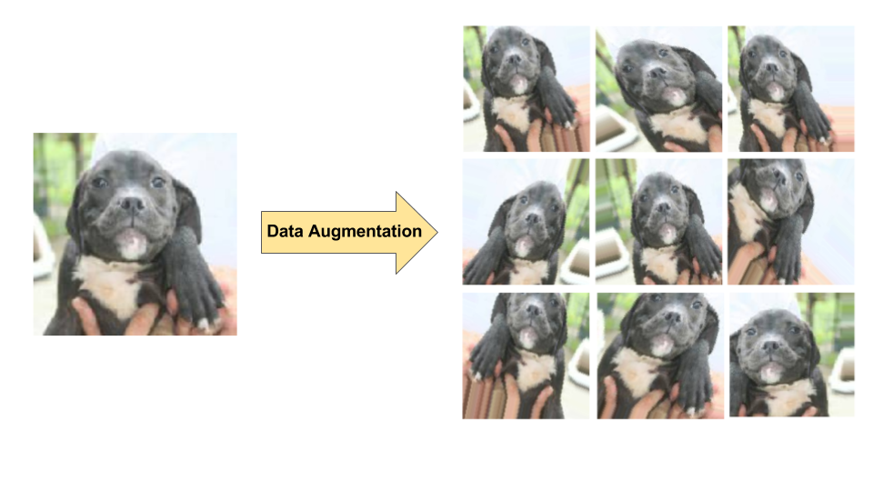
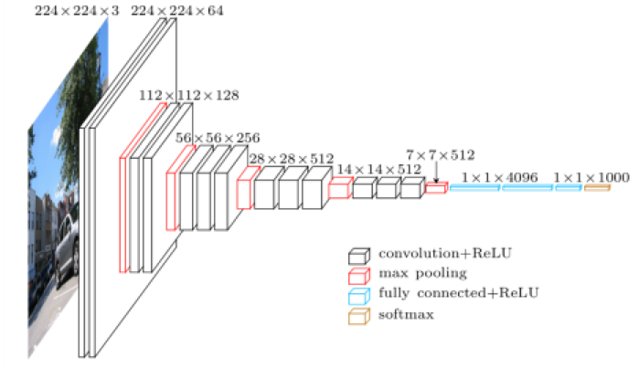
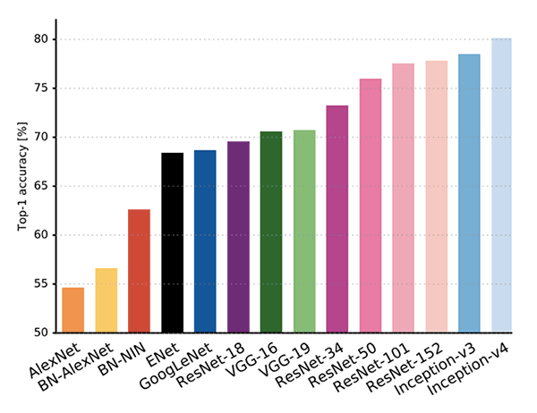

```{r setup, include=FALSE}
knitr::opts_chunk$set(echo = TRUE)
Sys.setenv(TF_CPP_MIN_LOG_LEVEL = "3") # Car TensorFlow est extrèmement bavard...
```

```{r ws_41_banner, echo=FALSE, fig.cap="", out.width = '100%'}

```

Continuons notre voyage dans l'apprentissage profond avec cet atelier basé sur un jeu de données provenant d'une compétition Kaggle: **Planet: Understanding the Amazon from Space**. Jusqu'à présent, nous avons appris à mettre en oeuvre les réseaux de neurones convolutifs profonds **from scratch**. Nous allons maintenant voir toute la puissance de l'**apprentissage par transfert**, qui consiste à partir d'un modèle pré-existant et déjà entrainé sur des millions d'images.

Il existe toute une collection de modèles plus ou moins complexes ayant fait leur preuve: Vgg16, Inception, ResNet, etc... Ceux-ci sont disponibles dans Keras. Nous allons voir qu'il est possible d'ajuster l'un de ces modèles existant en l'adaptant à une nouvelle problématique de classification.

Le jeu de données **Planet: Understanding the Amazon from Space** étant relativement volumineux, nous utiliserons cette fois-ci les générateurs de Keras pour procéder au chargement des données "à la volée".


```{r}
suppressMessages(library(dplyr))
suppressMessages(library(plotly))
suppressMessages(library(ggplot2))
suppressMessages(library(qdap))
suppressMessages(library(scales))
suppressMessages(library(tidytext))
suppressMessages(library(raster))
suppressMessages(library(magick))
suppressMessages(library(tidyr))
suppressMessages(library(tibble))
library(keras)
```


## 1. Exploration du jeu de données "Planet: Understanding the Amazon from Space"

Ce jeu de données correspond à une [compétition](https://www.kaggle.com/c/planet-understanding-the-amazon-from-space) de science des données et d'apprentissage automatique organisée sur Kaggle, en 2017. 

Analysons tout d'abord le fichier des annotations:

#### EXERCICE: Charger le fichier des annotations (data/train_v2.csv). Nommer la variable `annotations`.

```{r}
# ~ 1 ligne de code
annotations <- read.csv("data/train_v2.csv")
```

Affichons sa structure:

```{r}
str(annotations)
```

On constate que le jeu de données comprend **40.479** observations (images). Si l'on regarde la colonne `tags` (étiquette) de plus près, nous voyons qu'il y a au total **449** combinaisons d'étiquettes différentes.

A des fins pratiques (temps d'entrainement), nous travaillerons sur un sous-ensemble de données. Mettez ces lignes en commentaires pour travailler sur le jeu de données complet:

#### EXERCICE: Compléter le code ci-dessous pour obtenir un sous ensemble aléatoire de taille SUBSET_SIZE. Conseil: utilisez les fonctions sample_n() et droplevels()

```{r}
SUBSET_SIZE <- 5000
annotations <- droplevels(sample_n(annotations, SUBSET_SIZE)) # À compléter ~ 1 ligne de code
```

Affichons la structure du sous-ensemble:

```{r}
str(annotations)
```

Analysons la distribution des différentes combinaisons d'étiquettes:

```{r}
tags_gr <- annotations %>%
  group_by(tags) %>%
  summarise(count=n()) %>%
  arrange(desc(count)) %>%
  mutate(percentage=count/nrow(annotations))

head(tags_gr, n=20)

ggplot(data=head(tags_gr, n=20), aes(x=tags, y=count)) + geom_bar(stat = "identity", fill="blue", alpha="0.5") + theme(axis.text.x = element_text(angle = 45, hjust = 1))

```

La combinaison la plus fréquente est "clear primary". Il est également intéressant de constater que l'étiquette "cloudy" apparait en troisième position. Analysons maintenant la distribution du nombre d'étiquettes par observation:

```{r}
tags_per_image <- as.data.frame(wc(as.character(annotations$tags)))
colnames(tags_per_image) <- c("nr_of_tags")

summary(tags_per_image)

ggplot(data=tags_per_image, aes(x=nr_of_tags)) + geom_histogram(binwidth=1, fill="blue", alpha="0.5") + scale_y_continuous(breaks= pretty_breaks())

```

La plupart des images ont au moins deux étiquettes différentes. Il y en a aussi quelques unes avec 1, 3, 4 et 5 étiquettes. Le nombre maximal d'étiquettes pour une image est 9 (s'il s'agit du sous-ensemble "aléatoire", ce nombre peut varier).

Maintenant, nous allons regarder l'occurence de chaque étiquette prise séparément:

```{r}
annotations$tags <- as.character(annotations$tags)
single_tags <- unnest_tokens(annotations, word, tags, token = "words")

head(single_tags, 10)

gr_single_tags <- single_tags %>%
  group_by(word) %>%
  summarise(count=n()) %>%
  arrange(desc(count)) %>%
  mutate(percentage=count/nrow(annotations))

print(gr_single_tags)

ggplot(data=gr_single_tags, aes(x=word, y=percentage)) + geom_bar(stat = "identity", fill="blue", alpha="0.5") + geom_text(aes(label=percentage), vjust=-0.5, color="black", size=2.5) + theme(axis.text.x = element_text(angle = 45, hjust = 1))
```

L'information ci-dessus est intéressante: l'étiquette `primary` est présente dans plus de 92% des images, puis en seconde position vient l'étiquette `Clear` à 70%. Comme nous l'avons vu précedemment, la combinaison des étiquettes `primary` et `clear` est la plus fréquente.

Visualisons maintenant quelques images:

```{r}
image_nr <- character(20)

for (i in 1:20) {
  image_nr[i] <- as.character((annotations %>%
                                 filter(tags==tags_gr$tags[i]))[i,1])}

for (i in 1:20) {
  file_name <- paste('data/train-jpg/',image_nr[i],'.jpg', sep="")
  plot(image_read(file_name))
  title(main=as.character(tags_gr$tags[i]))}
```


## 2. Préparation et augmentation des données

Cette fois-ci, les données seront chargées et normalisées "à la volée" lors de l'entrainement. Cette approche à plusieurs avantages:

* Lorsque le jeu de données est trop volumineux pour tenir dans la mémoire vive.
* Lorsque l'on souhaite appliquer des transformations sur les images afin d'**augmenter** les données.

**Un mot sur l'augmentation de données:**

L'apprentissage profond requiert des volumes de données importants et les performances peuvent ne pas être au rendez-vous lorsque les données ont une taille limitée. Pour obtenir une meilleure généralisation dans votre modèle, vous avez besoin de plus de données et de la plus grande variation possible dans les données. Parfois, le jeu de données n'est pas assez grand pour capturer une variation suffisante. Dans ce cas, nous devons générer plus de données à partir du jeu de données en notre possession:


```{r ws_41_data_augmentation, echo=FALSE, fig.cap="", out.width = '100%'}

```

Afin de réaliser cette opération, Keras vient avec ce que l'on appelle des **générateurs**. Voyons leur mise en oeuvre:

#### EXERCICE: Compléter le code ci-dessous en appliquant une normalisation et des retournements (flip) horizontaux et verticaux.

```{r}
# ~ 1-4 lignes de code
datagen <- image_data_generator(
    rescale = 1/255,
    horizontal_flip = TRUE,
    vertical_flip = TRUE
  )
```

Le générateur défini ci-dessus sera utilisé par la fonction [flow_images_from_dataframe](https://www.rdocumentation.org/packages/keras/versions/2.2.4.1/topics/flow_images_from_dataframe).

Quelques modifications doivent être apportées à `annotations`:
* Rajouter l'extension de l'image (.jpg)
* Transformer les tags en liste

```{r}
annotations$list_tags = strsplit(annotations$tags, " ")
annotations$image_name <- lapply(annotations$image_name, as.character)
annotations$image_name <- paste(annotations$image_name,".jpg", sep="")

class_names = c("primary",
                "clear",
                "agriculture",
                "road",
                "water",
                "partly_cloudy",
                "cultivation",
                "habitation",
                "haze",
                "cloudy",
                "bare_ground",
                "selective_logging",
                "artisinal_mine",
                "blooming",
                "slash_burn",
                "blow_down",
                "conventional_mine")
```


```{r}
train_image_array_gen <- flow_images_from_dataframe(dataframe=annotations[1:3000,],
                                          directory="data/train-jpg/", 
                                          generator=datagen,
                                          x_col="image_name",
                                          y_col="list_tags",
                                          batch_size=8,
                                          seed=42,
                                          shuffle=TRUE,
                                          class_mode="categorical",
                                          classes=class_names,
                                          target_size = c(200,200)
                                          )
```

```{r}
valid_image_array_gen <- flow_images_from_dataframe(dataframe=annotations[3001:5000,],
                                          directory="data/train-jpg/", 
                                          generator=datagen,
                                          x_col="image_name",
                                          y_col="list_tags",
                                          batch_size=8,
                                          seed=42,
                                          shuffle=TRUE,
                                          class_mode="categorical",
                                          classes=class_names,
                                          target_size = c(200,200)
                                          )
```


## 3. Entraînement d'une architecture de type VGG-16

Nous allons utiliser un réseau de neurones très populaire et relativement léger, VGG-16. Il s'agit d'un réseau convolutifs constitué de 16 couches ayant obtenu un taux d'erreur top-5 de 7.5% sur ILSVRC-2012.

Plus de détails à propos de son architecture peuvent être trouvés sur la [publication](https://arxiv.org/abs/1409.1556):

> Very Deep Convolutional Networks for Large-Scale Image Recognition
> K. Simonyan, A. Zisserman
> arXiv:1409.1556

```{r ws_41_vgg16, echo=FALSE, fig.cap="", out.width = '100%'}

```

#### EXERCICE: En utilisant la fonction correspondante de Keras, charger un réseau VGG-16 sans initialisation de poids (weights) et sans inclure les couches supérieures (include_top).

```{r}
# ~ 1 ligne de code
base_model <- application_vgg16(weights=NULL, include_top = FALSE)
```

#### EXERCICE: Rajouter maintenant les couches supérieures: VGG16 -> GLOBAL AVERAGE POOLING -> DENSE (relu) -> DENSE (sigmoid). Choisissez un nombre de neurones de sortie correspondant au nombre de classes.

```{r}
# ~ 5 lignes de code
model <- keras_model_sequential() %>%
  base_model %>%
  layer_global_average_pooling_2d() %>% 
  layer_dense(units = 512, activation = "relu") %>%
  layer_dense(units = 17, activation = "sigmoid")
```

Vous pouvez afficher le sommaire du modèle:

#### QUESTION: Que constatez-vous ?

```{r}
summary(model)
```

#### EXERCICE: Compiler le modèle

```{r}
# ~ 1 ligne de code
model %>% compile(optimizer = optimizer_adam(lr=0.0001), loss = 'binary_crossentropy', metrics='accuracy')
```

En ayant deux générateurs, nous devons utliser `[fit_generator](https://www.rdocumentation.org/packages/keras/versions/2.2.4.1/topics/fit_generator)`

#### EXERCICE: Compléter la fonction fit_generator avec les bons paramètres

```{r}
batch_size <- 8
epochs <- 5

history <- model %>% fit_generator(
    # À compléter ~ 5 lignes de code  
    train_image_array_gen,
    steps_per_epoch = as.integer(3000/batch_size), 
    epochs = epochs,
    validation_data = valid_image_array_gen,
    validation_steps = as.integer(2000/batch_size)
  )
```


## 4. Apprentissage par transfert

Nous allons maintenant voir tout l'intérêt d'utiliser un réseau de neurones pré-entrainé. En effet, VGG-16 et les autres réseaux disponibles dans Keras ont été entrainés sur [IMAGENET](http://www.image-net.org/), une base de données d'images annotées à destination des travaux de recherche en vision par ordinateur contenant plus de dix millions d'entrées.

#### EXERCICE: Reprendre la même architecture utilisée ci-dessus, en incluant cette fois ci les poids d'IMAGENET (weights='imagenet').

```{r}
# ~ 6-7 lignes de code
base_model <- application_vgg16(weights='imagenet', include_top = FALSE)

#freeze_weights(base_model)

model <- keras_model_sequential() %>%
  base_model %>%
  layer_global_average_pooling_2d() %>% 
  layer_dense(units = 512, activation = "relu") %>%
  layer_dense(units = 17, activation = "sigmoid")
```

#### EXERCICE: Reprendre la même compilation que dans l'exercice précédent

```{r}
# ~ 1 ligne de code
model %>% compile(optimizer = optimizer_adam(lr=0.0001), loss = 'binary_crossentropy', metrics='accuracy')
```

#### EXERCICE: Reprendre les mêmes paramètres d'entraînement que dans l'exercice précédent.

```{r}
batch_size <- 8
epochs <- 5

history_transfer <- model %>% fit_generator(
    # À compléter ~ 5 lignes de code
    train_image_array_gen,
    steps_per_epoch = as.integer(3000/batch_size), 
    epochs = epochs,
    validation_data = valid_image_array_gen,
    validation_steps = as.integer(2000/batch_size)
  )
```

#### QUESTION: Que constatez-vous ?


```{r}
compare_cx <- data.frame(
  vgg_noweights_train = history$metrics$loss,
  vgg_noweights_val = history$metrics$val_loss,
  vgg_imagenet_train = history_transfer$metrics$loss,
  vgg_imagenet_val = history_transfer$metrics$val_loss
) %>%
  rownames_to_column() %>%
  mutate(rowname = as.integer(rowname)) %>%
  gather(key = "type", value = "value", -rowname)
  
ggplot(compare_cx, aes(x = rowname, y = value, color = type)) +
  geom_line() +
  xlab("epoch") +
  ylab("loss")

compare_cx <- data.frame(
  vgg_noweights_train = history$metrics$acc,
  vgg_noweights_val = history$metrics$val_acc,
  vgg_imagenet_train = history_transfer$metrics$acc,
  vgg_imagenet_val = history_transfer$metrics$val_acc
) %>%
  rownames_to_column() %>%
  mutate(rowname = as.integer(rowname)) %>%
  gather(key = "type", value = "value", -rowname)
  
ggplot(compare_cx, aes(x = rowname, y = value, color = type)) +
  geom_line() +
  xlab("epoch") +
  ylab("accuracy")
```


## 5. Autres architectures (OPTIONNEL)

Bien que prisé pour sa simplicité, VGG-16 est dépassé en terme de performances et rapidité par d'autres architectures plus complexes et profondes.

```{r ws_41_arch_benchmark, echo=FALSE, fig.cap="", out.width = '100%'}

```

#### EXERCICE: En suivant les mêmes étapes définies ci-dessus, choisissez une autre architecture et appliquez un apprentissage par transfert sur le jeu de données de cet atelier.

[Using Pre-Trained Models](https://cran.rstudio.com/web/packages/keras/vignettes/applications.html)


## 6. Pour aller plus loin (OPTIONNEL)

Tel que constaté lors de la phase d'exploration, les étiquettes sont fortement débalancées, avec une prédominance nette de "clear" et "primary". Il se peut que lors de forts débalancements de classes, le réseau devienne fainéant et prédise toujours la classe dominante. Pour palier à ce problème, Keras propose un paramètre nommé sample_weight, qui applique une pénalité aux classes dominantes directement proportionnelle à leur fréquence.

#### EXERCICE: Ré-entrainer le réseau de neurones de votre choix en prenant en compte le débalancement des classes.


## Sources

* [Exploring the dataset, by Jürgen F.](https://www.kaggle.com/juergenf/exploring-the-dataset)
* [It's that easy! Image classification with keras in roughly 100 lines of code.](https://shirinsplayground.netlify.com/2018/06/keras_fruits/)
* [http://flovv.github.io/Logo_detection_transfer_learning/](Transfer Learning with Keras in R)
* [application_vgg, Documentation R](https://www.rdocumentation.org/packages/keras/versions/2.2.4/topics/application_vgg)
* [Generates batches of data from images in a directory (with optional augmented/normalized data)](https://keras.rstudio.com/reference/flow_images_from_directory.html)
* [Multi-label image classification Tutorial with Keras ImageDataGenerator](https://medium.com/@vijayabhaskar96/multi-label-image-classification-tutorial-with-keras-imagedatagenerator-cd541f8eaf24)
* [ML Practicum: Image Classification](https://developers.google.com/machine-learning/practica/image-classification/preventing-overfitting)

